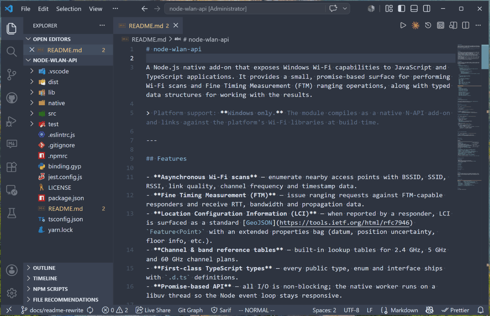

# Azure DevOps Markdown PR Review

[](https://github.com/abeltrano/markdown-pr-review/actions/workflows/ci.yml)
[](https://codecov.io/gh/abeltrano/markdown-pr-review)
[](LICENSE)
[](https://marketplace.visualstudio.com/items?itemName=abeltrano.md-pr-review)
[](https://marketplace.visualstudio.com/items?itemName=abeltrano.md-pr-review)

A Visual Studio Code extension for reviewing markdown files in pull
requests using a fully rendered view — select text directly in the
rendered content to create PR comment threads anchored to the
underlying lines.



---

## Why this exists

Reviewing a markdown file in a pull request normally forces you onto a
raw-markdown diff: formatting is erased, mermaid diagrams are walls of
source, and pinning a comment to "the second paragraph of section 3"
means scrolling through lines of syntax.

This extension renders the file the way you would actually read it —
markdown is rendered, mermaid is rendered, and text selection works as
you expect. Select any passage in the rendered view and post a comment;
it becomes a real thread on the pull request, anchored to the
underlying lines.

---

## Supported source-control providers

| Provider | Status | Notes |
| --- | --- | --- |
| Azure DevOps | ✅ Supported | PR URL form `https://dev.azure.com/{org}/{project}/_git/{repo}/pullrequest/{n}` |
| GitHub | 🛣️ Planned | Tracked in [issue #18](https://github.com/abeltrano/markdown-pr-review/issues/18) |
| GitLab | ❌ Not planned | File an issue if you need it |
| Bitbucket | ❌ Not planned | File an issue if you need it |

---

## Telemetry

**This extension collects no telemetry.** It does not call out to any
analytics service, does not emit usage events, and does not include the
`@vscode/extension-telemetry` package. The only outbound network
traffic is direct REST calls to the SCM provider whose PR you have
opened (Azure DevOps today). If this policy ever changes it will be
flagged prominently in the release notes and you will be able to opt
out via `telemetry.telemetryLevel` per the
[VS Code telemetry contract](https://code.visualstudio.com/docs/getstarted/telemetry).

---

## Install

### From the Visual Studio Marketplace (recommended once published)

1. Open the **Extensions** sidebar in VS Code (`Ctrl+Shift+X`).
2. Search for **Markdown PR Review**.
3. Click **Install**.

Or from the command line:

```powershell
code --install-extension abeltrano.md-pr-review
```

### Sideload a `.vsix` (fallback / pre-release builds)

1. Download the latest `md-pr-review-*.vsix` from the
   [Releases page](https://github.com/abeltrano/markdown-pr-review/releases)
   (or build one locally — see [Development](#development)).
2. In VS Code: **Extensions** sidebar → `...` menu →
   **Install from VSIX…** → pick the file.
3. Reload VS Code if prompted.

Or from the command line:

```powershell
code --install-extension .\md-pr-review-*.vsix
```

---

## Quick start

1. **Sign in.** On first use you will be prompted to sign in via the
   Microsoft account provider (the same one VS Code uses for Azure /
   Microsoft sign-in). If MSAL is unavailable you can supply a Personal
   Access Token — see [Required Azure DevOps PAT scopes](#required-azure-devops-pat-scopes).
2. **Open a PR.** Press `Ctrl+Shift+P` → run **Markdown PR Review:
   Open Pull Request…**. Paste the PR URL, for example
   `https://dev.azure.com/contoso/MyProject/_git/MyRepo/pullrequest/12345`.
3. **Pick a markdown file.** The **Markdown PR Review** activity-bar
   view lists all `.md` / `.markdown` / `.mdx` files in the PR. Click
   one to open it in the rendered viewer.
4. **Comment on text.** Select any text in the rendered view; the
   **Comment Input** panel populates with a quoted preview. Type and
   press **Post**. The thread appears in the rendered view immediately
   and on the PR web page as a real thread.
5. **Read existing threads.** Every thread already on the PR shows up
   as a clickable marker beside the line it was anchored to.

That's the whole loop. See
[Commands and keybindings](#commands-and-keybindings) for shortcuts
once you've done it a few times.

---

### Required Azure DevOps PAT scopes

If you fall back to PAT auth (most users won't need to — interactive
Microsoft sign-in is preferred), generate the token at
**User settings → Personal access tokens** in Azure DevOps and grant
the minimum scopes:

| Scope | Why |
| --- | --- |
| **Code → Read** | Listing PR files and reading their content. |
| **Pull Request Threads → Read & write** | Reading existing comment threads and posting new ones. |

No other scopes are required. Use a short expiry (30–90 days) and
scope the PAT to the specific organization you review in. The token is
stored in VS Code's `SecretStorage` (OS-level keychain), never in
settings or workspace state.

---

## Commands and keybindings

| Command                                  | Default key       | Notes                                                            |
| ---------------------------------------- | ----------------- | ---------------------------------------------------------------- |
| **Markdown PR Review: Open Pull Request…**    | —                 | Accepts a full PR URL or a bare PR number (see settings below).  |
| **Markdown PR Review: Refresh Threads**       | `Ctrl+Alt+R`      | Re-fetches threads on the active PR.                             |
| **Markdown PR Review: Add Comment to Selection** | `Ctrl+Alt+C`   | Focuses the comment input sidebar for the current selection.     |
| **Markdown PR Review: Refresh to Head Commit**| `F5`              | Re-opens the PR at the latest head commit.                       |
| **Markdown PR Review: Close Session**         | —                 | Clears the active PR session.                                    |

Keybindings only fire when the rendered editor is focused
(`activeCustomEditorId == 'markdownPrReview.renderedView'`).

---

## Settings

All settings live under **Markdown PR Review** in VS Code
**Settings**.

| Setting                                | Default | Description                                                    |
| -------------------------------------- | ------- | -------------------------------------------------------------- |
| `markdownPrReview.defaultOrganization`      | `""`    | Default ADO organization. Set with `defaultProject` to allow bare-PR-id input. |
| `markdownPrReview.defaultProject`           | `""`    | Default ADO project. Must accompany `defaultOrganization`.     |
| `markdownPrReview.staleCommitPollSeconds`   | `30`    | How often to poll for new commits on the active PR. Range 15–60. |

---

## What is rendered

- **CommonMark** (paragraphs, headings, lists, blockquotes, tables,
  fences) per markdown-it defaults.
- **Mermaid diagrams** — fenced as ```` ```mermaid ``` ```` are
  rendered to SVG client-side. Selection within the SVG is not
  supported for comment anchoring (you can still anchor a comment to
  the diagram block as a whole).
- **Code fences** with the language hint shown.
- **Raw HTML** is escaped (rendered as text). This is intentional for
  v0.4 — a sanitizer pass is a future enhancement.

Comments themselves are rendered as plain text in the popover to keep
the webview bundle small.

---

## Known limitations (v0.4)

These are documented in [`docs/requirements.md`](docs/requirements.md)
§2.2 as out of scope:

- **Multi-PR**: only one PR session is active at a time. Opening a new
  PR closes the previous session.
- **Editing/deleting comments**: post-only. Edit or resolve threads in
  the SCM provider's web UI.
- **Reply to a specific comment**: posting always creates a new
  thread anchored to the selection.
- **Right-side panel of resolved threads**: only active threads show
  markers; resolved threads must be reviewed in the SCM web UI.
- **GitHub / Bitbucket / GitLab**: Azure DevOps only today. GitHub
  support is tracked in
  [issue #18](https://github.com/abeltrano/markdown-pr-review/issues/18).
- **Side-by-side base/head view**: the rendered view always shows the
  head version with diff gutter bars indicating change state.
- **Comment markdown rendering inside popovers**: comments display
  as plain text (whitespace preserved) for now.
- **HTML passthrough**: raw HTML blocks are escaped.

---

## Troubleshooting

### Where is the log?

Open the **Output** panel (`View → Output`), then pick **ADO Markdown
PR Reviewer** from the dropdown. Every REST call, every selection
mapping, and every error is recorded here with a timestamp and a
component tag. Errors include a stable code (`E_ADO_AUTH`,
`E_ADO_PERM`, etc.) so you can grep the log.

When a user-facing error appears, the **Open Output** button on the
notification jumps straight to this channel.

### "Azure DevOps rejected your credentials" (`E_ADO_AUTH`)

Sign in via the Microsoft account provider was successful but the
returned token does not authorize the requested ADO resource. On the
next REST call you will be re-prompted exactly once. If the second
attempt also fails, the extension falls back to offering a Personal
Access Token via Secret Storage.

### "Your account does not have permission" (`E_ADO_PERM`)

403 from ADO. Check that you have **Read** on the repository and
**Contribute to pull requests** for posting comments.

### "Azure DevOps returned 404" (`E_ADO_NOT_FOUND`)

Most often a typo in the PR URL or a project/repo you cannot see. The
**Open Output** action shows the exact URL that returned 404.

### Mermaid diagrams render as source

Check that the fence info string is exactly `mermaid` (lowercase, no
extra characters). If rendering still fails, the log records the
mermaid error message.

### Stale PR notification keeps appearing

The default 30 s poll interval will detect new commits within that
window. Increase `markdownPrReview.staleCommitPollSeconds` if you find it
intrusive, or use the **Close Session** command to stop polling.

---

## Capability matrix by version

| Capability                                          | v0.1 | v0.2 | v0.3 | v0.4 |
| --------------------------------------------------- | :--: | :--: | :--: | :--: |
| Open ADO PR by URL                                  |  ✅  |  ✅  |  ✅  |  ✅  |
| Rendered markdown view                              |  ✅  |  ✅  |  ✅  |  ✅  |
| Mermaid diagram rendering                           |  ✅  |  ✅  |  ✅  |  ✅  |
| Select-to-comment round-trip                        |  ✅  |  ✅  |  ✅  |  ✅  |
| Existing thread markers + inline popover            |  —   |  ✅  |  ✅  |  ✅  |
| Multi-file picker with directory grouping           |  —   |  ✅  |  ✅  |  ✅  |
| Diff gutter bars (added / modified / deleted)       |  —   |  —   |  ✅  |  ✅  |
| Status bar with PR + thread count                   |  —   |  —   |  —   |  ✅  |
| Stale-commit watcher (auto-detect new head)         |  —   |  —   |  —   |  ✅  |
| 401 silent retry                                    |  —   |  —   |  —   |  ✅  |
| User-facing error codes + Open Output action        |  —   |  —   |  —   |  ✅  |

---

## Repository layout

```
.
├── package.json                  # Extension manifest
├── tsconfig.json                 # TypeScript strict mode
├── esbuild.js                    # Bundler config (host + 2 webviews)
├── .mocharc.cjs                  # Test config (mocha + tsx)
├── docs/
│   ├── requirements.md           # REQ-IDs (source of truth)
│   ├── design.md                 # Architecture, components, contracts
│   └── validation-plan.md        # Test cases TC-001…TC-165
├── src/                          # Extension host code
└── test/unit/                    # Mocha unit tests (90 currently)
```

---

## Development

```powershell
npm install
npm run compile     # tsc --noEmit && esbuild (dev)
npm run watch       # esbuild rebuilds on save
npm test            # mocha against test/unit/**/*.test.ts
npm run build       # tsc + production esbuild
npm run package     # build + vsce package
```

Press **F5** in VS Code (with the **Run Extension** launch config) to
debug in a fresh VS Code window.

---

## License

MIT. See [`LICENSE`](LICENSE).
