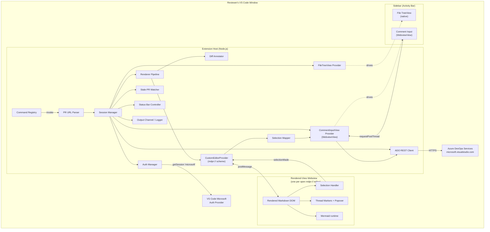

# ADO Markdown PR Reviewer — Design Document

## 1. Overview

This design specifies the implementation architecture for the ADO Markdown PR Reviewer Visual Studio Code extension. It is the design counterpart to [`requirements.md`](requirements.md) v0.3 (REQ-CORE-*, REQ-COMMENT-*, REQ-AUTH-*, REQ-DIFF-*, REQ-UX-*, REQ-ERR-*, REQ-NFR-*) in this folder. The extension lets a single reviewer fetch a markdown file from an Azure DevOps pull request, render it (with Mermaid diagrams) in a sandboxed VS Code webview, **select text** in the rendered view to author a new comment, and post that comment back to ADO as a PR comment thread anchored to the correct raw line range.

The dominant design challenge is the **round-trip** between rendered content (where the human reasons) and raw line ranges (where ADO threads anchor). This design solves it in two coordinated layers: (1) `markdown-it`'s native block-level source maps annotate every rendered DOM block with `data-source-line-start`/`data-source-line-end` attributes; (2) a **selection mapper** in the extension host takes the reviewer's rendered-text selection and the containing block's raw source, normalizes both, and locates the selection's precise position in the raw source. The resulting precise line/offset range becomes the ADO `threadContext.rightFileStart`/`rightFileEnd`. When precise mapping isn't feasible (selection spans multiple blocks, contains a Mermaid diagram, or matches non-uniquely in normalized raw text), it falls back deterministically to the smallest-containing-block range, logging the fallback to the output channel so the behavior is observable.

Key design goals, ordered: (1) **Correct anchoring** of rendered-view selections to raw-source line/offset ranges, precise where possible and predictably coarse where not. (2) **Daily-use polish** — auth that doesn't re-prompt, errors that surface clearly, no surprising failure modes. (3) **Implementable in one weekend** for v0.1 — small surface area, no native dependencies, sensible defaults everywhere. (4) **Phased delivery** that matches the requirements (v0.1 → v0.4) so each phase ships a usable improvement.

## 2. Requirements Summary

This design addresses the following requirement groups from `requirements.md`:

| Group | REQ-IDs | Design sections that address them |
|---|---|---|
| Core review session | REQ-CORE-001 … REQ-CORE-007 | §3.2 (Command Registry, PR Parser, ADO Client, Session Manager, Renderer Pipeline, CustomEditorProvider, Rendered-View Webview, FileTreeView) |
| Commenting | REQ-COMMENT-001 … REQ-COMMENT-006 | §3.2 (SelectionMapper, Comment Controller, CommentInputView, Rendered-View Webview), §4.1 (postMessage protocol, ADO threads endpoint), §4.3 (draft state) |
| Authentication | REQ-AUTH-001, REQ-AUTH-002 | §3.2 (Auth Manager), §5 (Decision: Auth provider), §6 (Security) |
| Diff awareness | REQ-DIFF-001, REQ-DIFF-002 | §3.2 (Diff Annotator), §5 (Decision: Block-level token diff) |
| User experience | REQ-UX-001 … REQ-UX-003 | §3.2 (Status Bar Controller, Configuration), §4.1 (commands/keybindings), §5 (Decision: File picker location) |
| Error handling | REQ-ERR-001 … REQ-ERR-003 | §3.2 (Logger, Stale-PR Watcher), §7 (Operational) |
| Non-functional | REQ-NFR-PERF-001, NFR-UX-001, NFR-COMPAT-001, NFR-MAINT-001, NFR-SEC-001 | §5 (Decisions: Bundler, Tests, State storage, Rendered-view surface), §6 (Security), §7 (Operational) |
| Constraints | CON-001 … CON-007 | §3.1 (Architecture honors single-user, ADO-Services-only, no workspace mutation), §6 (CSP) |

## 3. Architecture

### 3.1 High-Level Architecture

The extension runs in **two distinct execution contexts** mandated by the VS Code extension model:

1. **Extension host** — a Node.js process; has access to VS Code APIs, network, file system (read-only per CON-006).
2. **Webview** — a sandboxed Chromium iframe; HTML/CSS/JavaScript only; no Node APIs; communicates with the host only via `postMessage`.

The boundary between these two contexts is the single most important architectural line in this design. All ADO REST calls happen in the extension host; webviews never make network calls. The rendered-view webview owns rendering, selection detection, and marker injection; the comment-input webview owns the draft-comment UX; the host owns orchestration. The extension also contributes a native `TreeView` for file selection so the rendered-view webview can remain content-only.



**Trust boundaries** (relevant to §6 Security):

- Reviewer ↔ Microsoft AAD (managed by VS Code; we never see raw credentials).
- Extension host ↔ ADO REST API (HTTPS; bearer token in `Authorization` header).
- Extension host ↔ Webview (postMessage; structured JSON only, no eval).
- Webview ↔ markdown content (treated as untrusted; HTML passthrough disabled per NFR-SEC-001 AC-2).

### 3.2 Component Descriptions

#### Command Registry

- **Responsibility**: Register VS Code commands and route invocations. (REQ-CORE-001, REQ-UX-001, REQ-UX-003)
- **Interfaces**: Registers the review commands — including `markdownPrReview.openPullRequest`, `markdownPrReview.refreshThreads`, `markdownPrReview.addComment`, and `markdownPrReview.refreshToHead` — plus the internal `markdownPrReview.focusRenderedView` used by the status-bar click. Default keybindings: `markdownPrReview.addComment` (`ctrl+alt+c`), `markdownPrReview.refreshThreads` (`ctrl+alt+r`), and `markdownPrReview.refreshToHead` (`f5`), each active only while the rendered view is focused (`activeCustomEditorId == 'markdownPrReview.renderedView'`).
- **Dependencies**: PR URL Parser, Session Manager.
- **Constraints**: Activation event tied to command invocation (`onCommand:markdownPrReview.openPullRequest`) to keep cold-start cost zero.

#### PR URL Parser

- **Responsibility**: Convert reviewer input (full URL, bare PR ID, or `org/project/repo/id` triple) into a normalized `PullRequestRef`. (REQ-CORE-001, ASM-001, RISK-007)
- **Interfaces**: `parse(input: string, settings: Settings) → PullRequestRef | ParseError`.
- **Dependencies**: `markdownPrReview.defaultOrganization` and `markdownPrReview.defaultProject` from VS Code configuration (REQ-UX-002).
- **Constraints**: Must accept BOTH `microsoft.visualstudio.com/{project}/_git/{repo}/pullrequest/{id}` AND `dev.azure.com/{org}/{project}/_git/{repo}/pullrequest/{id}`. Internally normalized to `dev.azure.com/{org}/...` to dodge legacy-host quirks (RISK-007 mitigation).

#### Branch PR Discovery

- **Responsibility**: Discover active PRs whose source branch is the current branch of the active workspace repository, and open the chosen one through the existing pipeline. (REQ-CORE-008, ASM-010)
- **Interfaces**: The `markdownPrReview.openPullRequestForCurrentBranch` command orchestrates `resolveActiveBranchContext()` (`git-context.ts`) → `listActivePullRequestsBySourceBranch(coords, branch)` (ADO Client) per candidate remote → `dedupeDiscoveredPullRequests` + `toBranchPrQuickPickItems` (`branch-pr-picker.ts`) → `SessionManager.openPullRequest(ref)`.
- **Dependencies**: the built-in VS Code Git extension API (`vscode.git`, read-only, under the CON-007 carve-out), ADO Client, Session Manager. Pure sub-modules: `ado-remote-parser.ts` (remote URL → coordinates), `discovered-pr.ts` (wire shape → `DiscoveredPullRequest`), `branch-pr-picker.ts` (Quick Pick items + ref).
- **Constraints**: Reads only the branch name and remote URLs via the in-process Git API — never a git binary (CON-007) and never a workspace write (CON-006). Same-repo PRs only in v1; fork-sourced PRs are a documented non-goal (REQ-CORE-008 AC-3). The Quick Pick is shown even for a single match. The branch is queried as `refs/heads/{branch}`, single-encoded by `buildUrl`. Never logs a raw remote URL (may embed a PAT).

#### Auth Manager

- **Responsibility**: Obtain and refresh an ADO-scoped access token. (REQ-AUTH-001, REQ-AUTH-002, ASM-006, RISK-003)
- **Interfaces**: `getToken({ silent?: boolean }) → Promise<string>`; emits `onTokenInvalid` for ADO Client to react to 401s.
- **Dependencies**: `vscode.authentication.getSession('microsoft', scopes, { createIfNone, silent })`.
- **Constraints**: Scope set is initialized to `['499b84ac-1321-427f-aa17-267ca6975798/.default']` per ASM-006; if the VS Code Microsoft provider rejects that scope, falls back to PAT mode (RISK-003 mitigation — open question §8).

#### ADO REST Client

- **Responsibility**: Make all HTTPS calls to ADO Services and return typed responses; redact bearer tokens before logging. (REQ-CORE-002, REQ-CORE-003, REQ-CORE-004, REQ-COMMENT-004, REQ-COMMENT-005, REQ-DIFF-002, REQ-ERR-001)
- **Interfaces**: 
  - `getPullRequest(ref) → PullRequest`
  - `getChangedFiles(ref, sha) → ChangedFile[]`
  - `getFileContent(repoId, sha, path) → string`
  - `getThreads(ref) → Thread[]`
  - `createThread(ref, threadContext, comment) → Thread`
  - `getMergeBaseSha(ref) → string`
- **Dependencies**: Auth Manager (for bearer token), Logger (for request/response telemetry).
- **Constraints**: Pinned to API version `7.1`. On 401, calls `Auth Manager.getToken({ silent: false })` once and retries; second 401 surfaces an error (REQ-AUTH-002 AC-2). On 429, exponential backoff with jitter, max 3 retries (RISK-002 mitigation). All log lines pass through `redactAuthHeaders()` before being written (REQ-ERR-001 AC-3).

#### Session Manager

- **Responsibility**: Hold per-session state — `PullRequestRef`, head SHA, merge-base SHA, file list, opened-editors map, threads cache, active draft. (REQ-CORE-002, REQ-CORE-006, REQ-COMMENT-005 AC-3, REQ-ERR-002, ASM-005)
- **Interfaces**: `openSession(ref) → Session`; `closeSession()`; `requestRender(filePath) → { html, sourceMap }`; getters for state; emits `onStateChanged`.
- **Dependencies**: ADO Client, Renderer Pipeline, CustomEditorProvider, FileTreeView, CommentInputView provider, Stale-PR Watcher, Status Bar Controller, Comment Controller.
- **Constraints**: At most one active session per VS Code window (CON-001, ASM-005). When the last `mdpr://` editor closes, all child resources (webviews, watcher, status bar item, view container) are disposed.

#### Renderer Pipeline

- **Responsibility**: Convert raw markdown to annotated HTML strings. (REQ-CORE-005, REQ-CORE-007, REQ-DIFF-001)
- **Interfaces**: `render({ markdown, diffAnnotations? }) → RenderResult` where `RenderResult = { html, sourceMap, mermaidBlockCount }`.
- **Dependencies**:
  - **`markdown-it`** (existing npm package, ~50 KB minified) — handles all CommonMark + GFM parsing and HTML rendering. **We write no parsing code.** Configured with `html: false`, `linkify: true`, `breaks: false`. Block source maps are produced by `markdown-it`'s default `core` rules out of the box (`token.map`).
  - **`markdown-it-attrs`** and **`markdown-it-anchor`** (existing npm packages) — optional, evaluated during v0.1 spike for adding inline attribute syntax and heading anchor IDs. If they add complexity without clear value, drop them.
  - A **small renderer-rules layer** in `src/renderer/` (our code; estimated ~150 lines total) that uses `markdown-it`'s standard public plugin API (`md.renderer.rules[token_type] = (tokens, idx, ...) => string`) to:
    - Add `data-source-line-start`/`data-source-line-end` attributes to every block-level token (~50 lines, see "Renderer rules added by this extension" below).
    - Override the `fence` renderer when the info string is `mermaid` to emit a placeholder `<div class="mermaid">` for client-side rendering (~30 lines — see "Mermaid fence rule" below for why we don't use a 3rd-party plugin).
    - Inject `data-diff-state` attributes on tokens whose source-line range matches a `DiffAnnotation`.
  - **`mermaid`** (existing npm package, ~1 MB) — handles all diagram rendering inside the webview at page-load via `mermaid.run()`. **We write no diagram-rendering code.**
  - The Diff Annotator (in-house) for `data-diff-state` decoration data.
- **Constraints**: Rendering runs in the extension host (NOT the webview) to keep the webview's CSP strict; the resulting HTML string is sent to the webview via postMessage. The webview then attaches the Mermaid runtime to any `<div class="mermaid">` containers.

##### Renderer rules added by this extension

These are small functions in `src/renderer/` that hook into `markdown-it`'s public plugin API. They do not parse markdown; they only annotate or replace the HTML emitted by `markdown-it`'s built-in renderers.

1. **`paragraph_open`, `heading_open`, `list_item_open`, `blockquote_open`, `table_open`, `fence` (non-mermaid)**: Add `data-source-line-start={token.map[0] + 1}` and `data-source-line-end={token.map[1]}` attributes. (Per REQ-CORE-005 AC-1; `+1`/`-0` adjustment converts `markdown-it`'s 0-indexed end-exclusive map to ADO's 1-indexed inclusive line numbers — ASM-004.)
2. **`fence` with `info === 'mermaid'`** (Mermaid fence rule): Replace default rendering with `<div class="mermaid" data-source-line-start=... data-source-line-end=...><script type="text/x-mermaid">{escaped source}</script></div>`. The webview's bootstrap script extracts `<script type="text/x-mermaid">` content and feeds it to `mermaid.render()` after page load. (REQ-CORE-007 AC-3)
   - We don't reuse a 3rd-party `markdown-it-mermaid` plugin because (i) most don't emit the `data-source-line-*` attributes we need for selection mapping; (ii) the CSP-safe encoding of the diagram source (HTML-escape into a `<script type="text/x-mermaid">` body) is specific to our strict CSP; (iii) the rule is ~30 lines, less than the cost of pinning and validating a third-party plugin's upgrade path. This is the only rendering primitive we hand-roll.
3. **`html_block`**: Even with `html: false`, `markdown-it` still emits these tokens but renders them escaped. Annotate them with source-line attributes so REQ-COMMENT-002 AC-4's walk-up logic finds them.

#### Diff Annotator

- **Responsibility**: Compute block-level diff between head version and merge-base version of a file, emit per-block annotations consumed by the Renderer. (REQ-DIFF-001, REQ-DIFF-002, RISK-006)
- **Interfaces**: `annotate(headMarkdown, baseMarkdown) → DiffAnnotation[]` where each annotation maps a head-version block line range to one of `unchanged | added | modified | context-of-deletion`, plus optional `deletedContent: string` for context-of-deletion entries.
- **Dependencies**: `markdown-it` (for block tokenization).
- **Constraints**: Algorithm tokenizes BOTH files into block sequences, computes a Myers-style diff over normalized block hashes (normalize by stripping whitespace + lowercasing for comparison), then maps the diff hunks back to head-version line ranges. NOT a naive line-diff (RISK-006 mitigation).

#### CustomEditorProvider (host side)

- **Responsibility**: Register a `vscode.CustomReadonlyEditorProvider` for the `mdpr://` URI scheme. Each open PR file becomes its own VS Code editor tab; VS Code manages the lifecycle (open, focus, close, hot-exit, panel layout) for free. (REQ-CORE-001 AC-2, REQ-NFR-SEC-001)
- **Interfaces**: `openCustomDocument(uri)`, `resolveCustomEditor(document, webviewPanel)`. Internally: `postMessage(uri, msg)`, `onDidReceiveMessage(uri, handler)`.
- **Dependencies**: VS Code Webview API, Session Manager (to fetch rendered HTML + threads + diff annotations for the URI's PR/file), CSP composer (§6).
- **Constraints**: CSP per §6; bundled assets served via `webview.asWebviewUri(...)`. The provider is registered for **only** the `mdpr://` scheme so it cannot accidentally activate on real workspace files. Closing the editor disposes the underlying `Session`'s reference to this file (but not the session itself; other files may still be open).

#### Rendered-View Webview (renderer side)

- **Responsibility**: Render the markdown HTML received from the host; detect user text selections and report them; render thread markers; show read-only thread popovers on marker click; lazy-load and render Mermaid. (REQ-CORE-005, REQ-CORE-007, REQ-COMMENT-002, REQ-COMMENT-005, REQ-COMMENT-006, REQ-DIFF-001 visual layer)
- **Layout** (single page, no chrome — chrome lives in native VS Code surfaces):
  - Top status strip: PR title, short head SHA (REQ-CORE-002 AC-1), stale-commit warning banner (when applicable; REQ-ERR-002).
  - Main pane: rendered markdown with gutter change bars (REQ-DIFF-001) and inline thread markers (REQ-COMMENT-005).
  - No file picker (lives in native TreeView; see FileTreeView below).
  - No inline comment input (lives in CommentInputView sidebar; see below).
- **Selection handling** (REQ-COMMENT-001, REQ-COMMENT-002):
  - On `mouseup` and `keyup` events, check `window.getSelection()` for a non-collapsed range whose anchor and focus are both inside the rendered content region.
  - Resolve the smallest single block ancestor that contains the entire selection (walk up from the common ancestor to nearest element with `data-source-line-*`).
  - Read the rendered plain text of the selection (`range.toString()`) and the rendered plain text of the block up to the selection start (for disambiguation).
  - Read the block's `data-source-line-*` range.
  - postMessage `selectionMade` to the host with: `{ filePath, blockLineRange, selectedText, textBeforeSelection, spansMultipleBlocks: boolean, containerKind: 'paragraph' | 'mermaid' | 'html-block' | 'code-fence' | 'list-item' | 'table' | 'heading' | 'blockquote' }`.
  - Also visually distinguish the selected text with a persistent CSS class until host responds with `selectionCleared` (e.g., when input is posted or cancelled) — this satisfies REQ-COMMENT-001 AC-5 (selection visibility persists after focus leaves rendered view).
- **Marker handling**:
  - On `init` and `threadsRefreshed`, inject thread markers next to blocks whose source-line ranges contain a thread's `rightFileStart.line` (REQ-COMMENT-005 AC-1).
  - Marker click → show a positioned popover (in-DOM) with the thread's comments rendered via the same markdown-it bundle (REQ-COMMENT-006).
- **Dependencies**: HTML payload received from host (already source-line-annotated by the Renderer Pipeline), Mermaid runtime (lazy-loaded per REQ-CORE-007 AC-5), thread data.
- **Constraints**: No external network access (CSP forbids); all data arrives via postMessage from the host; no `user-select: none` on rendered content (REQ-CORE-005 AC-3).

#### FileTreeView (host side, native `TreeView`)

- **Responsibility**: Provide a native sidebar tree of the PR's changed markdown files; selecting a file opens (or focuses) the corresponding `mdpr://` editor tab. (REQ-CORE-006)
- **Interfaces**: Implements `vscode.TreeDataProvider<FileNode>`. Refreshes via `onDidChangeTreeData` when Session Manager updates the file list or thread counts.
- **Dependencies**: Session Manager.
- **Constraints**: TreeView contributes to a custom view container in the activity bar (the `markdownPrReview` container), which is always present; the tree shows a placeholder node until a PR is opened. Each tree item carries a comment-count badge (REQ-CORE-006 AC-3). Clicking a file invokes `vscode.commands.executeCommand('vscode.openWith', mdprUri, 'markdownPrReview.renderedView')` which routes through the CustomEditorProvider.

#### CommentInputView (host side, sidebar `WebviewView`)

- **Responsibility**: Render the comment-draft UX in a sidebar `WebviewView`. Displays the file path, resolved line range, mapping mode (`precise` / `coarse-<reason>`), and a multi-line textarea pre-populated with the auto-quoted snippet. (REQ-COMMENT-001, REQ-COMMENT-003)
- **Interfaces**: Implements `vscode.WebviewViewProvider`. Receives `selectionPosted` and `error` from the host; sends `requestPostThread` and `cancelDraft` to the host.
- **Dependencies**: VS Code WebviewView API, Selection Mapper output (delivered by Comment Controller).
- **Constraints**: 
  - Becomes visible on `selectionPosted`; uses `webviewView.show(preserveFocus: false)` so keyboard focus moves to the textarea immediately.
  - Displays mapping mode prominently (REQ-COMMENT-002 AC-6) so reviewer can refine selection before posting if anchoring is coarser than desired.
  - Snapshots all selection state from the message payload at receive time — the rendered-view webview's `window.getSelection()` may be cleared by the time the input is visible, so input does not depend on it.
  - Maintains exactly one active draft at a time. A new `selectionMade` while a non-empty draft exists prompts "Save / discard / cancel."

#### Selection Mapper (host side)

- **Responsibility**: Implement the precise-with-coarse-fallback algorithm that converts a `selectionMade` payload (rendered selection + bounding block source range) into an ADO-ready `{ rightFileStart, rightFileEnd, mappingMode }`. (REQ-COMMENT-002 AC-1, AC-2, AC-3)
- **Interfaces**: `mapSelection({ rawFileContent, blockLineRange, selectedText, textBeforeSelection, spansMultipleBlocks, containerKind }) → MappingResult` where `MappingResult = { rightFileStart, rightFileEnd, mappingMode: 'precise' | 'coarse-mermaid' | 'coarse-html-block' | 'coarse-multi-block' | 'coarse-ambiguous-text' | 'coarse-text-not-found' }`.
- **Algorithm**:
  1. If `spansMultipleBlocks` → return coarse `union of all spanned block ranges` (mode: `coarse-multi-block`).
  2. If `containerKind === 'mermaid'` → return coarse `blockLineRange` (mode: `coarse-mermaid`).
  3. If `containerKind === 'html-block'` → return coarse `blockLineRange` (mode: `coarse-html-block`).
  4. Otherwise (precise candidate):
     - Extract raw lines `[blockLineRange.start, blockLineRange.end]` from `rawFileContent`.
     - Build a **normalized-to-raw position map**: walk the raw block text and produce a parallel "rendered-equivalent" string by stripping markdown formatting characters (`*`, `_`, backticks for inline code spans, link-target portion of `[text](url)`, leading list markers, table pipe separators, fence delimiters); maintain a map from each character index in the normalized string back to (line, offset) in the raw source.
     - Apply the same normalization to `selectedText` and `textBeforeSelection`.
     - Search for the normalized selection in the normalized raw block, starting from the position determined by `textBeforeSelection.length`. If unique match in that range → translate match start/end back to (line, offset) via the position map → return precise result.
     - If not found there but found uniquely elsewhere → return precise result with the unique match's position; log a `selection-position-disambiguation` note.
     - If found non-uniquely with no disambiguation possible → return coarse `blockLineRange` (mode: `coarse-ambiguous-text`).
     - If not found at all → return coarse `blockLineRange` (mode: `coarse-text-not-found`).
- **Dependencies**: Session Manager (for cached raw file content), Logger (for fallback observability).
- **Constraints**: 
  - Pure function (deterministic, no side effects other than logging).
  - MUST always return a valid result (never throws on input from the webview; malformed input → log error + return safe coarse default).
  - Unit testable in isolation; coverage of each `mappingMode` enum value required for v0.2+ test plan.

#### Comment Controller (host side)

- **Responsibility**: Orchestrate the selection → mapping → input → post pipeline. Receives `selectionMade` from a rendered-view webview, invokes Selection Mapper, sends `selectionPosted` to the CommentInputView. Receives `requestPostThread` from CommentInputView, POSTs to ADO via ADO Client immediately (no batching, no review-submit workflow per CON-005), propagates result back to both views. (REQ-COMMENT-004, REQ-COMMENT-005 AC-3, CON-005)
- **Interfaces**: Internal — invoked by CustomEditorProvider's message handler and by CommentInputView's message handler.
- **Dependencies**: Selection Mapper, ADO REST Client (createThread), Session Manager (to update threads cache and find the right rendered-view webview to push `threadCreated` back to), CommentInputView (for `selectionPosted`, `error`), CustomEditorProvider (for `threadCreated`, `selectionCleared`).
- **Constraints**: On POST failure, sends `error` message to CommentInputView with detail; the draft is preserved (REQ-COMMENT-004 AC-2). On success, sends `threadCreated` to the originating rendered-view webview AND `draftCleared` to CommentInputView.

#### Stale-PR Watcher

- **Responsibility**: Periodically poll the PR's source branch head and emit `staleCommit` when it advances past the pinned SHA. (REQ-ERR-002)
- **Interfaces**: `start(session)`, `stop()`.
- **Dependencies**: ADO Client (cheap call: `getPullRequest(ref)` and compare `lastMergeSourceCommit`).
- **Constraints**: Poll interval honored to be ≥15s and ≤60s, default 30s (REQ-ERR-002 AC-3); only one timer per session. Detection of HEAD advance mitigates RISK-004 (author pushes mid-session invalidating source-line mapping for drafts) by surfacing the stale state before the reviewer Posts.

#### Status Bar Controller

- **Responsibility**: Show/hide a status bar item reflecting active session. (REQ-UX-001)
- **Interfaces**: `show(session, file)`; `hide()`.
- **Dependencies**: VS Code Status Bar API.
- **Constraints**: Click action = `markdownPrReview.focusRenderedView`; disposed on session close (REQ-UX-001 AC-3).

#### Output Channel / Logger

- **Responsibility**: Centralized logging with token redaction. (REQ-ERR-001)
- **Interfaces**: `info(msg, ctx?)`, `warn(msg, ctx?)`, `error(msg, ctx?)`; `redactAuthHeaders(headers) → headers`.
- **Dependencies**: `vscode.window.createOutputChannel('ADO Markdown PR Reviewer')`.
- **Constraints**: Token redaction MUST be the last step before any write (NFR-SEC-001, REQ-ERR-001 AC-3); enforce via a wrapping function that all paths funnel through.

### 3.3 Data Flow

```mermaid
sequenceDiagram
  participant User
  participant Cmd as Command Registry
  participant Sess as Session Manager
  participant Auth as Auth Manager
  participant ADO as ADO REST Client
  participant Rend as Renderer Pipeline
  participant Tree as FileTreeView
  participant CEP as CustomEditorProvider
  participant RV as Rendered-View Webview
  participant SelMap as Selection Mapper
  participant Input as CommentInputView

  User->>Cmd: invoke openPullRequest, paste URL
  Cmd->>Sess: openSession(ref)
  Sess->>Auth: getToken()
  Auth-->>Sess: token
  Sess->>ADO: getPullRequest(ref)
  ADO-->>Sess: PR meta + headSha
  Sess->>ADO: getChangedFiles(ref, headSha)
  ADO-->>Sess: files[] (filtered to .md*)
  Sess->>ADO: getThreads(ref)
  ADO-->>Sess: threads[]
  Sess->>Tree: refresh(files, threadCounts)
  Tree-->>User: native sidebar tree visible
  User->>Tree: click file
  Tree->>CEP: openWith(mdpr://...)
  CEP->>Sess: requestRender(filePath)
  Sess->>ADO: getFileContent(repoId, headSha, file)
  ADO-->>Sess: rawMarkdown
  Sess->>Rend: render({ rawMarkdown, diffAnnotations })
  Rend-->>Sess: { html, sourceMap }
  Sess-->>CEP: { html, threads, sha, diffAnnotations }
  CEP->>RV: postMessage(init: { html, threads, diffAnnotations })
  RV-->>User: rendered view with markers
  Note over User,RV: User selects text in a paragraph
  RV->>RV: detect selection complete; resolve block ancestor
  RV->>CEP: postMessage(selectionMade: { filePath, blockLineRange,<br/>selectedText, textBeforeSelection, ... })
  CEP->>SelMap: mapSelection(payload + rawFileContent)
  SelMap-->>CEP: { rightFileStart, rightFileEnd, mappingMode }
  CEP->>Input: postMessage(selectionPosted: { filePath, range,<br/>mappingMode, quote, originatingFileUri })
  Input-->>User: sidebar input visible + focused
  User->>Input: types comment, clicks Post
  Input->>CEP: postMessage(requestPostThread: { filePath, range, content })
  CEP->>ADO: createThread(ref, threadContext, comment)
  ADO-->>CEP: createdThread
  CEP->>Sess: update threads cache
  CEP->>Input: postMessage(draftCleared)
  CEP->>RV: postMessage(threadCreated + selectionCleared: { thread })
  RV-->>User: marker appears, selection highlight cleared
```

## 4. Detailed Design

### 4.1 API Contracts

#### 4.1.1 ADO REST endpoints consumed

All endpoints use base URL `https://dev.azure.com/{org}` (normalized from `microsoft.visualstudio.com` per §3.2 PR URL Parser) and API version `7.1`. All require `Authorization: Bearer {token}`.

| Endpoint | Method | Purpose | REQ |
|---|---|---|---|
| `/_apis/git/repositories/{repositoryId}/pullRequests/{pullRequestId}?api-version=7.1` | GET | Fetch PR metadata including `lastMergeSourceCommit` (head SHA), `lastMergeTargetCommit` (target's tip at last merge), `lastMergeCommit` (merge base if any), source/target ref names | REQ-CORE-002 |
| `/_apis/git/repositories/{repositoryId}/pullRequests/{pullRequestId}/iterations?api-version=7.1&$top=1&$skip={N-1}` | GET | Resolve `commonRefCommit` (merge base) — read `commonRefCommit.commitId` from the latest iteration | REQ-DIFF-002 |
| `/_apis/git/repositories/{repositoryId}/pullRequests/{pullRequestId}/iterations/{iterationId}/changes?api-version=7.1` | GET | List changed files in the PR | REQ-CORE-003 |
| `/_apis/git/repositories/{repositoryId}/items?path={path}&versionDescriptor.version={sha}&versionDescriptor.versionType=commit&api-version=7.1` | GET (with `Accept: text/plain`) | Fetch file content at a specific commit | REQ-CORE-004, REQ-DIFF-002 |
| `/_apis/git/repositories/{repositoryId}/pullRequests/{pullRequestId}/threads?api-version=7.1` | GET | List all comment threads on the PR | REQ-COMMENT-005 |
| `/_apis/git/repositories/{repositoryId}/pullRequests/{pullRequestId}/threads?api-version=7.1` | POST | Create a new comment thread | REQ-COMMENT-004 |
| `/_apis/git/repositories/{repositoryId}/pullrequests?searchCriteria.sourceRefName=refs/heads/{branch}&searchCriteria.status=active&api-version=7.1` | GET | List active PRs whose source branch is `{branch}` (active-branch discovery); the raw ref value is passed to `buildUrl`, which percent-encodes it exactly once | REQ-CORE-008 |

##### Thread creation payload (REQ-COMMENT-004)

```jsonc
{
  "comments": [
    {
      "parentCommentId": 0,
      "content": "> <auto-quoted block text, up to 200 chars>...\n\n<reviewer's comment body>",
      "commentType": 1  // 1 = "text"
    }
  ],
  "status": 1, // 1 = "active"
  "threadContext": {
    "filePath": "/docs/design.md",
    "rightFileStart": { "line": 47, "offset": 1 },
    "rightFileEnd":   { "line": 49, "offset": 9999 }
  }
}
```

`rightFileEnd.offset` is set to a sentinel large value (`9999`) to anchor through end-of-line; ADO accepts this and clamps to the actual line length in the rendered web UI. `rightFileStart.offset = 1` anchors at line start. ASM-004 records this as `[UNKNOWN]` pending implementation verification.

##### Error response handling

| HTTP | Action | REQ |
|---|---|---|
| 200/201 | Parse and return | — |
| 401 | Invalidate token, refresh once via Auth Manager, retry; if still 401, surface and stop | REQ-AUTH-002 |
| 403 | Surface "Access denied — your account may not have permission for this repository" | REQ-ERR-001 |
| 404 | Surface "Resource not found — check the PR URL or your access" | REQ-ERR-001 AC-1 |
| 429 | Exponential backoff (1s, 2s, 4s + jitter), max 3 retries, then surface | RISK-002 |
| 5xx | Single retry after 2s; if still 5xx, surface | REQ-ERR-001 |
| Network failure (DNS, ECONNREFUSED) | Surface "Cannot reach Azure DevOps" | REQ-ERR-001 AC-2 |

#### 4.1.2 postMessage protocol

There are **two** webviews and one native TreeView per session, each with its own protocol channel to the extension host. Schemas use a discriminator `type` field on JSON objects.

##### Host → Rendered-View Webview (one channel per open `mdpr://` editor)

```typescript
type HostToRenderedView =
  | { type: 'init'; payload: RenderedViewInitPayload }
  | { type: 'threadCreated'; payload: { thread: Thread } }
  | { type: 'threadsRefreshed'; payload: { threads: Thread[] } }
  | { type: 'selectionCleared' }
  | { type: 'error'; payload: { code: string; message: string; recoverable: boolean; details?: unknown } }
  | { type: 'staleCommit'; payload: { newSha: string; oldSha: string } };

interface RenderedViewInitPayload {
  sessionId: string;
  filePath: string;
  pullRequest: { id: number; title: string; sourceRef: string; targetRef: string };
  headSha: string;
  baseSha: string;
  fileContent: { html: string; sourceMap: Record<string, [number, number]> };
  threads: Thread[];
  diffAnnotations: DiffAnnotation[];
  protocolVersion: 1;
}
```

##### Rendered-View Webview → Host

```typescript
type RenderedViewToHost =
  | { type: 'ready' }
  | { type: 'selectionMade'; payload: SelectionMadePayload }
  | { type: 'refreshThreads' }
  | { type: 'refreshToHead' }
  | { type: 'log'; payload: { level: 'info' | 'warn' | 'error'; message: string; context?: unknown } };

interface SelectionMadePayload {
  filePath: string;
  blockLineRange: { start: number; end: number };   // 1-indexed
  selectedText: string;                              // result of range.toString()
  textBeforeSelection: string;                       // block-anchor-to-selection-start rendered text
  spansMultipleBlocks: boolean;
  spannedBlockRanges?: Array<{ start: number; end: number }>;   // only when spansMultipleBlocks is true
  containerKind: 'paragraph' | 'heading' | 'list-item' | 'blockquote'
                | 'table' | 'code-fence' | 'mermaid' | 'html-block';
}
```

##### Host → CommentInputView (sidebar)

```typescript
type HostToInputView =
  | { type: 'selectionPosted'; payload: SelectionPostedPayload }
  | { type: 'draftCleared' }
  | { type: 'error'; payload: { code: string; message: string; recoverable: boolean; details?: unknown } };

interface SelectionPostedPayload {
  filePath: string;
  rightFileStart: { line: number; offset: number };
  rightFileEnd: { line: number; offset: number };
  mappingMode: 'precise' | 'coarse-mermaid' | 'coarse-html-block'
              | 'coarse-multi-block' | 'coarse-ambiguous-text' | 'coarse-text-not-found';
  autoQuote: string;                              // already truncated to 200 chars per REQ-COMMENT-003 AC-2
  originatingFileUri: string;                     // mdpr:// URI of source webview, used for threadCreated routing
}
```

##### CommentInputView → Host

```typescript
type InputViewToHost =
  | { type: 'ready' }
  | { type: 'requestPostThread'; payload: PostThreadRequest }
  | { type: 'cancelDraft' }
  | { type: 'log'; payload: { level: 'info' | 'warn' | 'error'; message: string; context?: unknown } };

interface PostThreadRequest {
  filePath: string;
  rightFileStart: { line: number; offset: number };
  rightFileEnd: { line: number; offset: number };
  content: string;                                 // includes the auto-quoted prefix per REQ-COMMENT-003
  originatingFileUri: string;                      // pass-through from selectionPosted for routing
}
```

##### FileTreeView (host-internal, no postMessage)

FileTreeView is a native `TreeDataProvider`; its data flow is method calls (`getChildren`, `getTreeItem`, `onDidChangeTreeData`), not postMessage. Selection in the tree invokes `vscode.commands.executeCommand('vscode.openWith', mdprUri, 'markdownPrReview.renderedView')`.

##### Versioning strategy

Each protocol carries an optional `protocolVersion: number` field on `init` / `ready`-ack messages. Each webview ignores messages with unknown discriminators (logs a warning). Major version bump = bundled webview script must be re-shipped with the matching host.

#### 4.1.3 VS Code contributions (`package.json`)

| Contribution point | Value | REQ |
|---|---|---|
| `commands` | `markdownPrReview.openPullRequest`, `markdownPrReview.openPullRequestForCurrentBranch`, `markdownPrReview.refreshThreads`, `markdownPrReview.addComment`, `markdownPrReview.refreshToHead`, `markdownPrReview.showMarkdownOnly`, `markdownPrReview.showAllFiles`, `markdownPrReview.closeSession`, `markdownPrReview.closePullRequest`, `markdownPrReview.closeAllPullRequests` (the status-bar `markdownPrReview.focusRenderedView` is registered internally, not contributed) | REQ-CORE-001, REQ-CORE-008, REQ-UX-001, REQ-UX-003, REQ-COMMENT-001 AC-4, REQ-COMMENT-005 AC-3 |
| `keybindings` | `markdownPrReview.addComment` → `ctrl+alt+c`; `markdownPrReview.refreshThreads` → `ctrl+alt+r`; `markdownPrReview.refreshToHead` → `f5` — all `when: activeCustomEditorId == 'markdownPrReview.renderedView'` (overridable) | REQ-UX-003 AC-1, REQ-COMMENT-001 AC-4 |
| `configuration` | `markdownPrReview.defaultOrganization` (string, default `""`), `markdownPrReview.defaultProject` (string, default `""`), `markdownPrReview.staleCommitPollSeconds` (integer, default 30, min 15, max 60) | REQ-UX-002, REQ-ERR-002 AC-3 |
| `viewsContainers.activitybar` | `markdownPrReview` container with an activity-bar icon (always present) | REQ-CORE-006, REQ-COMMENT-001 |
| `views.markdownPrReview` | `markdownPrReview.fileTree` (TreeView), `markdownPrReview.recentPullRequests` (TreeView), `markdownPrReview.commentInput` (WebviewView) | REQ-CORE-006, REQ-COMMENT-001 AC-5 |
| `customEditors` | `markdownPrReview.renderedView` (priority `option`, `displayName: "Markdown PR Review"`), selecting `*.md` / `*.markdown` / `*.mdx` | REQ-CORE-001 AC-2, REQ-CORE-005 |
| `activationEvents` | `onCommand:markdownPrReview.openPullRequest`, `onCommand:markdownPrReview.openPullRequestForCurrentBranch`, `onView:markdownPrReview.fileTree`, `onView:markdownPrReview.recentPullRequests`, `onView:markdownPrReview.commentInput`, `onCustomEditor:markdownPrReview.renderedView` | NFR-PERF-001 (zero cold-start) |
| `engines.vscode` | `^1.85.0` | REQ-NFR-COMPAT-001 AC-1 |

Menu and keybinding `when` clauses use VS Code's built-in `activeCustomEditorId == 'markdownPrReview.renderedView'` context for rendered-view-focused actions, plus the `markdownPrReview.markdownOnly` context key set via `vscode.commands.executeCommand('setContext', ...)` by the FileTreeView to toggle the markdown-only filter.

### 4.2 Data Model

All types defined in [`src/types.ts`](../src/types.ts), exported throughout the extension host and (a subset) embedded in the webview bundle for type-checking via shared TypeScript project references.

```typescript
interface PullRequestRef {
  organization: string;     // e.g., "microsoft"
  project: string;          // e.g., "OS"
  repositoryId: string;     // GUID, resolved from name during open
  repositoryName: string;   // human-readable
  pullRequestId: number;
}

interface PullRequest {
  ref: PullRequestRef;
  title: string;
  sourceRefName: string;    // refs/heads/feature/foo
  targetRefName: string;    // refs/heads/main
  lastMergeSourceCommit: { commitId: string };  // head SHA
  status: 'active' | 'completed' | 'abandoned';
}

interface ChangedFile {
  filePath: string;          // e.g., /docs/design.md (leading slash, ADO convention)
  changeType: 'add' | 'edit' | 'delete' | 'rename';
  isMarkdown: boolean;       // derived: extension in {.md, .markdown, .mdx}
}

interface Thread {
  id: number;
  status: 'active' | 'fixed' | 'wontFix' | 'closed' | 'byDesign' | 'pending';
  publishedDate: string;     // ISO-8601
  comments: Comment[];
  threadContext: ThreadContext | null;  // null = PR-level (non-inline) comment
}

interface Comment {
  id: number;
  author: { displayName: string; uniqueName: string };
  content: string;
  publishedDate: string;
  commentType: 'text' | 'codeChange' | 'system';
}

interface ThreadContext {
  filePath: string;
  rightFileStart: { line: number; offset: number } | null;
  rightFileEnd: { line: number; offset: number } | null;
  // leftFileStart/End also exist but not used by this extension (we only review the head version)
}

interface DiffAnnotation {
  state: 'unchanged' | 'added' | 'modified' | 'context-of-deletion';
  headLineStart: number;     // 1-indexed
  headLineEnd: number;       // 1-indexed, inclusive
  deletedContent?: string;   // populated only for 'context-of-deletion'
}

type MappingMode =
  | 'precise'
  | 'coarse-mermaid'
  | 'coarse-html-block'
  | 'coarse-multi-block'
  | 'coarse-ambiguous-text'
  | 'coarse-text-not-found';

interface MappingResult {
  rightFileStart: { line: number; offset: number };
  rightFileEnd: { line: number; offset: number };
  mappingMode: MappingMode;
}

interface Draft {
  filePath: string;
  originatingFileUri: string;          // mdpr:// URI of the rendered-view webview
  range: { rightFileStart: { line: number; offset: number };
           rightFileEnd: { line: number; offset: number } };
  mappingMode: MappingMode;
  autoQuote: string;                   // already truncated per REQ-COMMENT-003 AC-2
  bodyText: string;                    // reviewer's in-flight content
}

interface Session {
  id: string;                          // UUID
  pr: PullRequest;
  headSha: string;
  baseSha: string;
  files: ChangedFile[];
  fileContentCache: Map<string, string>;  // filePath → raw markdown at headSha
  openedEditors: Map<string, vscode.WebviewPanel>;  // mdpr:// URI → panel from CustomEditorProvider
  threads: Thread[];
  activeDraft: Draft | null;           // at most one draft at a time (see §4.3.3)
  watcher: StalePRWatcher;
  statusBar: vscode.StatusBarItem;
}
```

### 4.3 State Management

#### 4.3.1 Session lifecycle

```
┌────────┐  openPullRequest   ┌────────────┐  last editor closed  ┌────────┐
│ Closed │ ─────────────────→ │ Active     │ ──────────────────→  │ Closed │
└────────┘                    │ (one       │                       └────────┘
                              │ session    │
                              │ per VS Code│  open additional file
                              │ window)    │ ←─────────────────┐
                              └────┬───────┘                   │
                                   │ staleCommit detected      │
                                   ▼                           │
                              ┌──────────┐ user accepts ───────┘
                              │ Warning  │
                              │ banner   │
                              └────┬─────┘
                                   │ user declines
                                   ▼
                              (Active, but pinned to old SHA)
```

- Session state is held **in-memory only** (CON-006 reinforces no workspace mutation; no need for persistent state in v1).
- Multiple `mdpr://` editors may be open simultaneously, one per file the reviewer has opened. The Session lives until the last such editor closes; closing the FileTreeView container alone does not end the session.
- Disposal cascade: when the last editor closes, `Session.dispose()` runs — clears the watcher timer, removes the status bar item, removes the activity-bar view container, disposes the auth-token cache for that session.

#### 4.3.2 Threads cache

- Loaded once at session start (REQ-COMMENT-005).
- Updated on three events: explicit user refresh (REQ-COMMENT-005 implicit), successful `createThread` POST (REQ-COMMENT-005 AC-3), stale-commit acceptance (full refetch).
- No background polling for threads (different from stale-commit polling — design decision §5).

#### 4.3.3 Draft comment state

- Lives **in the extension host** (`Session.activeDraft`), not in either webview. The CommentInputView reflects the draft via postMessage but is not the source of truth.
- At most one active draft per session. A new `selectionMade` while a non-empty draft exists prompts "Save / discard / cancel" via the CommentInputView before replacing.
- Each draft carries its `originatingFileUri` so `threadCreated` is routed back to the correct rendered-view webview when the user posts.
- Drafts are lost on VS Code restart (no persistence in v1; flagged §8 Open Question OQ-4).
- Cleared on: successful POST, user "Cancel", user "discard" in the prompt above.

#### 4.3.4 Head SHA pinning

- Captured at session start from `getPullRequest(ref).lastMergeSourceCommit.commitId` (REQ-CORE-002).
- All file fetches, diff base lookups, and source-map references use the pinned SHA.
- File switches preserve the pinned SHA (REQ-CORE-006 AC-2).
- Stale-commit refresh (user-accepted) re-pins and re-fetches everything (REQ-ERR-002 AC-2).

#### 4.3.5 Selection state lifecycle

Selection state is **transient**: snapshotted in the rendered-view webview at `mouseup`/`keyup`, immediately serialized into a `selectionMade` postMessage, and then **not retained** in the webview beyond CSS-class-based visual persistence (REQ-COMMENT-001 AC-5). The extension host owns the authoritative selection during the draft via `Session.activeDraft`. Lifecycle:

```
(no selection)
      │ user releases mouse/keyboard, range non-collapsed
      ▼
┌──────────────────────────────────┐
│ Rendered-view: selection snap-   │  selectionMade ──▶ host
│ shotted; .ado-pr-selected class  │
│ applied; payload sent            │
└──────────────────────────────────┘
      │ host maps via SelectionMapper, stores Draft, posts to CommentInputView
      ▼
(Draft active — selection highlight persists in rendered view; sidebar focused)
      │
      ├── user Posts ──▶ host POSTs to ADO; on success: draftCleared (sidebar) + threadCreated + selectionCleared (rendered view) ──▶ highlight removed
      ├── user Cancel ─▶ same draftCleared + selectionCleared, no POST
      └── user selects new text ─▶ host prompts (save/discard/cancel) before replacing Draft
```

- The browser-native selection is allowed to be cleared by VS Code (e.g., when focus moves to the sidebar). The visual `.ado-pr-selected` CSS class is what the reviewer sees as "what I'm commenting on."
- `selectionCleared` from host is the only path that removes the CSS class; the webview does not clear it on focus-loss alone (REQ-COMMENT-001 AC-5).

## 5. Tradeoff Analysis

### Decision: Rendered-view surface — custom webview vs. built-in markdown preview

- **Options considered**:
  (a) Custom `WebviewPanel` / `CustomEditorProvider` with our own bundled `markdown-it` renderer.
  (b) `vscode.MarkdownPreview` augmented via the three published extension points: `markdown.markdownItPlugins` (server-side `markdown-it` rules), `markdown.previewScripts` (client-side scripts injected into every preview), and `markdown.previewStyles` (client-side CSS). Bidirectional postMessage available via `vscode.workspace.onDidReceiveMessageFromMarkdownPreview` (stable since VS Code 1.64).
  (c) A read-only `TextEditor` with a custom `TextEditorDecorationType` overlay.
- **Decision**: (a) — custom webview surface.
- **Rationale**:
  1. **Contributions are global, not URI-scoped**. `markdownItPlugins`, `previewScripts`, and `previewStyles` apply to every markdown preview the reviewer opens — including unrelated workspace files. There is no per-document opt-in. Scripts can read `window.location` and no-op for non-`mdpr://` URIs, but `markdown-it` plugins run during server-side render in the host process with no per-document URI context exposed; guarding them is at best fragile and at worst impossible. Polluting the user's general markdown preview experience to bolt on PR review is unacceptable.
  2. **CSP ownership is forfeited**. REQ-NFR-SEC-001 mandates a strict CSP with explicit allow-lists for scripts, styles, fonts, and images. The built-in preview manages its own CSP and merges contributed scripts/styles into it; we cannot pin the policy, audit nonces, or guarantee that future VS Code preview changes don't loosen it. Owning the webview means owning the CSP.
  3. **Selection-to-source mapping is independent of surface choice**. The hard work (mapping rendered selections to raw markdown line/offset ranges) lives in our Selection Mapper component (REQ-COMMENT-002). The built-in preview gives us no extra leverage here — we still inject the same source-map attributes via `markdown-it` rules and still implement the same mapping algorithm. The built-in path saves us renderer code at the cost of items (1) and (2); the savings are not worth it.
  4. (c) shows raw markdown, not rendered — defeats the primary requirement REQ-CORE-005 AC-1.
- **Tradeoffs**: We don't inherit VS Code's preview polish (sync-scroll, link-click handling, "edit on click"); have to bundle our own renderer (~50 KB `markdown-it`) and own theme adoption (CSS variables — see §6).
- **Reversibility**: Hard — switching renderer surfaces would touch every component. This was explicitly re-evaluated in v0.2 after a research pass into the built-in preview's true API surface; the conclusion above is the documented result.

### Decision: Custom webview wrapper — `WebviewPanel` vs. `CustomEditorProvider`

- **Options considered**:
  (a) Single `WebviewPanel` per session, file content swapped in via postMessage on file change.
  (b) `CustomEditorProvider` registered for an `mdpr://` URI scheme; each PR file gets its own native editor tab opened via `vscode.openWith`.
- **Decision**: (b) — `CustomEditorProvider`.
- **Rationale**:
  - Each `mdpr://owner/proj/repo/PR-id/path/to/file.md` opens as a normal editor tab, identifiable in tab strip, drag-droppable into split editor groups, closable with `Ctrl+W`, restorable via "Reopen Closed Editor" (subject to VS Code's hot-exit semantics).
  - Multiple files can be viewed side-by-side, which is essential for design docs that reference each other (a common pattern in monorepos).
  - The "file" identity flows naturally to `threadCreated` routing: the rendered-view webview that owns the editor of `mdpr://...path/file.md` is the one that receives marker updates for that file.
  - Per-file lifecycle eliminates the postMessage-driven "swap file content in place" path that (a) requires, which is brittle when the reviewer navigates back to a previously open file.
- **Tradeoffs**: Slightly more boilerplate (`CustomEditorProvider` interface vs. one-time panel creation); reviewer can accidentally close a file tab and lose any in-flight scroll position (acceptable, drafts live in host).
- **Reversibility**: Moderate — the rendered-view webview script is identical between (a) and (b); switching only affects the host-side controller and the session model.

### Decision: File picker location — native `TreeView` vs. in-webview list

- **Options considered**:
  (a) Native VS Code `TreeDataProvider` rendered into a sidebar view container.
  (b) Custom file-list rendered inside the same webview as the rendered markdown.
- **Decision**: (a) — native `TreeView`.
- **Rationale**:
  - Reviewers get full VS Code keyboard navigation (arrow keys, type-ahead), familiar tree affordances (collapse/expand for folders if added later), and standard tooltip/badge surfaces for free.
  - Comment-presence indicators (REQ-CORE-006 AC-3) leverage `TreeItem.description` and `TreeItem.iconPath` — no custom rendering code.
  - Decoupling the file picker from the rendered view means closing one rendered-view editor doesn't affect navigation; opening multiple files keeps the picker stable.
  - Sidebar real estate is shared with the CommentInputView in the same activity-bar container, which feels coherent ("everything for this PR is in this sidebar").
- **Tradeoffs**: `TreeView` styling is constrained by VS Code's theme — we can't render rich previews (file size, last-modified) without resorting to `description` text. Acceptable for v1.
- **Reversibility**: Easy — `FileTreeView` is a thin adapter over the changed-file list.

### Decision: Comment input location — inline vs. sidebar `WebviewView` vs. native Comments API

- **Options considered**:
  (a) Inline input rendered inside the rendered-view webview adjacent to the selected block.
  (b) Sidebar `WebviewView` (CommentInputView) dedicated to the active draft.
  (c) VS Code's native Comments API (`vscode.comments`) bound to a synthesized text editor.
- **Decision**: (b) — sidebar `WebviewView`.
- **Rationale**:
  - The user pain point is **reading the rendered document** and **selecting text in it** (per requirements clarification driving v0.3 of `requirements.md`). The comment input mechanism is secondary; what matters is that the rendered view is uncluttered and the selection persists visibly while the reviewer composes.
  - A sidebar input means typing happens outside the rendered-view editor, freeing the rendered-view's vertical space and CSS layout from "input pops up next to a block" gymnastics (which would jump scroll position and obscure surrounding content).
  - Selection visibility persistence (REQ-COMMENT-001 AC-5) is straightforward when the rendered view holds the visual highlight via a CSS class controlled by the host — focus can leave for the sidebar without losing the user's mental anchor.
  - The CommentInputView is reusable across files: opening a different `mdpr://` editor doesn't recreate the input; it can hold the in-flight draft regardless of which rendered-view editor is active.
  - (c) lives in text editors, not webviews; binding it to a synthesized hidden editor to relay through the rendered view is high-friction and was the rationale for rejecting it in v0.1 — that rationale holds.
- **Tradeoffs**: Reviewer's eye has to dart between the rendered view and the sidebar; mitigated because the selected text is visibly highlighted *and* auto-quoted into the input (REQ-COMMENT-003).
- **Reversibility**: Moderate — UI layer only, doesn't touch the data model or postMessage discriminators.

### Decision: Comment anchoring — block-click coarse vs. text-selection precise

- **Options considered**:
  (a) Reviewer clicks a block (paragraph, heading, list item); comment anchors to that block's full line range.
  (b) Reviewer selects text; comment anchors to the precise character range via the Selection Mapper, with deterministic coarse fallback when precise mapping is impossible.
- **Decision**: (b) — text selection with precise mapping and coarse fallback.
- **Rationale**: Block-click cannot anchor to sub-block constructs (a single word in a sentence, a single row in a table, a single bullet of a paragraph-rich list item). Reviewers of design docs routinely want to comment "this word is wrong" or "this row of the table should be different" — block-click forces them to add coordinate-style instructions in the comment body. Text-selection-with-precise-mapping is the natural model.
- **Coarse-fallback strategy**: The Selection Mapper attempts a precise rendered-to-raw character mapping by (i) extracting the raw block text from the source map, (ii) normalizing both raw and rendered (strip `*`/`_`/backtick markers, link URLs, list/table markers), (iii) using `textBeforeSelection.length` to disambiguate when the selected substring appears more than once. On any deterministic failure (multi-block span, Mermaid container, HTML block, ambiguous text, text not found, or markdown-it source-map `null`/imprecise per RISK-001), the mapper falls back to anchoring at the originating block's full line range with a labeled `mappingMode` carried through the protocol so the CommentInputView can show the reviewer what happened. Every fallback is logged to the output channel (REQ-COMMENT-002 AC-6). This selection-with-line+offset-precision model aligns with CON-004 (sub-character anchors out of scope; multi-block selections coarsen).
- **Why precise mapping risks are acceptable**: The worst case of (b)'s precise path is identical to (a)'s normal case — block-range anchoring. There is no scenario where (b) produces *worse* anchoring than (a); the only risk is that (b)'s precise path silently produces wrong anchoring. The mapper's design (require unique normalized match within the block, fall back to coarse otherwise) makes silent wrong-anchoring impossible in non-pathological cases — the disambiguator (`textBeforeSelection`) is generated from the same rendered DOM the reviewer is looking at.
- **Tradeoffs**: ~300 lines of Selection Mapper code (worth it); reviewer must release the selection (mouseup) before the input appears (acceptable, matches editor conventions).
- **Reversibility**: Moderate — the protocol's `mappingMode` field gives a switch point: a future "always coarse" mode is one flag away.

### Decision: Inline comment UI vs. sidebar panel
**[Removed — superseded by "Comment input location" decision above.]**

### Decision: `markdown-it` directly vs. extending an existing extension

- **Options considered**:
  (a) Bundle `markdown-it` ourselves.
  (b) Fork "Markdown Preview Enhanced" or similar.
  (c) Use the built-in preview's `markdown-it` instance via the extension point.
- **Decision**: (a).
- **Rationale**: Built-in preview's `markdown-it` instance is not exposed for direct rendering by third-party extensions; the `markdownItPlugins` contribution point only mutates ITS preview, not ours. Forking a third-party extension inherits its design constraints with no proportionate benefit. Bundling `markdown-it` ourselves (~50 KB) keeps the renderer fully under our control and lets us run it in the extension host (where it's faster and where our Diff Annotator lives).
- **Tradeoffs**: Bundle size; need to keep pace with `markdown-it` version updates ourselves; no automatic theme adoption (handled in §6 styling).
- **Reversibility**: Easy — `markdown-it` is the *de facto* CommonMark renderer; alternative renderers (e.g., `remark`) all support comparable source-mapping.

### Decision: Mermaid client-side rendering vs. extension-host pre-render

- **Options considered**:
  (a) Bundle `mermaid` and run in the webview at page-load (REQ-CORE-007 AC-3 base case).
  (b) Pre-render every mermaid block to inert SVG in the extension host via `@mermaid-js/mermaid-cli` or a headless puppeteer, then send SVG strings to the webview.
- **Decision**: (a).
- **Rationale**: (a) is dramatically simpler — no Node-side puppeteer dependency, no inter-block coordination, leverages `mermaid`'s built-in rendering. (b) is the documented fallback path if (a) hits unfixable CSP issues per ASM-009.
- **Tradeoffs**: ~1 MB bundle (RISK-009; lazy-load mitigates per REQ-CORE-007 AC-5); requires CSP relaxation for inline styles (NFR-SEC-001 AC-3, RISK-010).
- **Reversibility**: Easy — fence-block source-line attributes are identical regardless of where mermaid runs (REQ-CORE-007 AC-3 + ASM-009).

### Decision: Inline comment UI vs. sidebar panel

**[Removed in v0.2 — superseded by the "Comment input location" decision above. Original v0.1 decision was (a) inline; v0.2 replaces with (b) sidebar `WebviewView` based on revised understanding of pain point — "uncluttered rendered view" trumps "input near target."]**

### Decision: Block-level token diff vs. line diff for REQ-DIFF-001

- **Options considered**:
  (a) Tokenize both versions with `markdown-it`, diff token sequences by content hash.
  (b) Run a line-level diff on raw markdown.
- **Decision**: (a).
- **Rationale**: Line diff mis-aligns when block boundaries shift (e.g., adding a new heading between two paragraphs moves all subsequent paragraphs' line numbers). Block-token diff is structural — it sees that "paragraph X is the same paragraph, just at different lines" and labels it `unchanged`. RISK-006 explicitly calls this out.
- **Tradeoffs**: More complex; need to handle reordered blocks (treat as delete + add); slightly slower for large files.
- **Reversibility**: Moderate — Diff Annotator is a swappable component.

### Decision: VS Code Microsoft Auth Provider vs. PAT-based auth

- **Options considered**:
  (a) `vscode.authentication.getSession('microsoft', scopes, ...)`.
  (b) Personal Access Token entered by user, stored in `vscode.SecretStorage`.
  (c) Device code flow with custom OAuth.
- **Decision**: (a), with (b) as a documented fallback per RISK-003.
- **Rationale**: (a) is zero-config for the user — leverages whatever Microsoft account they're already signed into VS Code with. (b) requires user to navigate ADO settings to create a PAT, manage expiry, etc. — violates "no irritation." (c) duplicates what (a) does for free.
- **Tradeoffs**: Depends on the Microsoft auth provider supporting the ADO scope (`499b84ac-...`) — flagged ASM-006/RISK-003; need to validate during v0.1 spike. If (a) blocks, we keep design intact and swap Auth Manager to PAT-source.
- **Reversibility**: Easy — Auth Manager is an isolated component with a single `getToken()` interface.

### Decision: Bundler — esbuild vs. webpack

- **Options considered**:
  (a) esbuild.
  (b) webpack.
  (c) tsc + no bundler (raw .js files referenced by the webview).
- **Decision**: (a) esbuild.
- **Rationale**: 10x+ faster cold builds, simpler config, well-supported in the VS Code Extension Samples. The extension is small enough that webpack's marginal features (sophisticated chunking) don't matter. (c) would require manual juggling of webview asset URIs and would not minify the mermaid bundle.
- **Tradeoffs**: Smaller ecosystem of plugins than webpack; less common in older VS Code extension tutorials.
- **Reversibility**: Easy — bundler is an internal build concern with no API impact.

### Decision: Test framework — minimal in v0.1, mocha for v0.2+

- **Options considered**:
  (a) No tests for v0.1, full mocha-based test harness from v0.2.
  (b) Jest from v0.1.
  (c) Mocha from v0.1.
- **Decision**: (a).
- **Rationale**: v0.1 is a spike to prove the round-trip; manual exercise against a real PR is the most informative validation. Tests added in v0.2 onward, when the design surface stabilizes, using Mocha (the VS Code standard).
- **Tradeoffs**: Less rigor in v0.1 (acceptable for "personal tool, daily-use" polish, especially given a planned manual round-trip verification).
- **Reversibility**: Easy — test framework can be added anytime.

### Decision: State storage — in-memory only vs. workspace state

- **Options considered**:
  (a) All session state in memory; nothing persisted.
  (b) Persist session state (current PR, draft comments) to `vscode.ExtensionContext.workspaceState`.
- **Decision**: (a).
- **Rationale**: Single-user, single-session tool (CON-001); persisting state across VS Code restarts adds complexity (stale-thread handling, ABA SHA problems) without clear UX value.
- **Tradeoffs**: A draft comment is lost if VS Code crashes mid-session (flagged §8).
- **Reversibility**: Moderate — adding persistence later requires migrating in-memory state into `workspaceState`.

## 6. Security Considerations

### Trust boundaries (recap from §3.1)

| Boundary | Threat | Mitigation |
|---|---|---|
| Reviewer ↔ Microsoft AAD | Credential theft | Managed entirely by VS Code's Microsoft auth provider; the extension never sees raw credentials (REQ-AUTH-001). |
| Extension host ↔ ADO REST API | MITM, token leak | HTTPS only; bearer token only in `Authorization` header; never logged (REQ-ERR-001 AC-3); never sent to any webview. |
| Extension host ↔ Rendered-View Webview | Webview script extraction of host secrets | Token never crosses the postMessage boundary; only typed JSON payloads with no auth material. Each rendered-view panel gets its own nonce-bound CSP. |
| Extension host ↔ CommentInputView (sidebar) | Same as above | Same mitigations; CommentInputView is a separate `WebviewView` with its own CSP (different nonce) and a strictly narrower postMessage surface — receives only `selectionPosted`/`draftCleared`/`error`, sends only `requestPostThread`/`cancelDraft`/`log`. |
| Rendered-View Webview ↔ Markdown content | XSS via malicious markdown | `html: false` on `markdown-it` (REQ-NFR-SEC-001 AC-2); CSP forbids inline scripts (REQ-NFR-SEC-001 AC-1); Mermaid in `securityLevel: 'strict'` (REQ-CORE-007 AC-4). |
| Rendered-View ↔ CommentInputView | Direct cross-webview tampering | No direct channel — all messages route through the host, which validates discriminators and re-stamps `originatingFileUri` from server-side state, not webview payloads. |

### Content Security Policy (NFR-SEC-001)

Both webviews carry a CSP built by the same [`csp.ts`](../src/views/csp.ts) helper at panel-creation time. Each panel gets its own per-instance nonce. The Rendered-View Webview policy:

```
default-src 'none';
img-src vscode-resource: vscode-webview: https: data:;
script-src 'nonce-{N}' vscode-webview:;
style-src vscode-resource: vscode-webview: 'unsafe-inline';
font-src vscode-resource: vscode-webview: data:;
connect-src 'none';
```

The CommentInputView CSP is **tighter** — no Mermaid, no inline `style` needs:

```
default-src 'none';
img-src vscode-resource: vscode-webview: data:;
script-src 'nonce-{N}' vscode-webview:;
style-src vscode-resource: vscode-webview:;
font-src vscode-resource: vscode-webview:;
connect-src 'none';
```

- `script-src 'nonce-{N}'` allows only our bundled scripts (each `<script>` tag carries `nonce="{N}"` where `{N}` is generated per-panel); blocks all inline or remote scripts.
- `style-src ... 'unsafe-inline'` on the rendered-view is the documented Mermaid exception (REQ-NFR-SEC-001 AC-3, ASM-009, RISK-010). The CommentInputView omits this exception because it never embeds Mermaid. Documented in code via a comment block above the CSP-construction function.
- `connect-src 'none'` forbids both webviews from making any network calls — all data arrives via postMessage from the host.

### Auth scope minimization (REQ-AUTH-001 AC-3)

- Request only `vso.code` + `vso.code_write` equivalent scopes (likely encoded as `499b84ac-1321-427f-aa17-267ca6975798/.default` per ASM-006, but exact narrower scopes preferable if supported).
- No workspace or project administration scopes requested.
- Per REQ-NFR-UX-001, `getSession()` is called with `{ silent: true }` for the lifetime of an active session after the first successful prompt; only a token refresh failure triggers a re-prompt.

### Token storage

- Tokens are obtained per-call via `vscode.authentication.getSession(...)` — VS Code manages the underlying secure storage. The extension itself holds the token only in process memory for the duration of a single REST call; no caching beyond the auth provider's own cache.

### Markdown injection vectors

- Raw HTML in markdown: blocked (`markdown-it` `html: false`). This eliminates RISK-005's attack surface but means legitimate inline HTML in design docs (e.g., `<details>` blocks, `<sub>` tags) renders as escaped text. Documented as a known limitation; addressable in a future version via an explicit allowlist (out of scope for v1, see CON-003).
- JavaScript URLs in links: `markdown-it` strips these by default.
- Mermaid script execution: `securityLevel: 'strict'` disables interactive features (click handlers in mermaid diagrams) and forbids any HTML embedded in diagram labels.

## 7. Operational Considerations

### Distribution

- v0.1–v0.4: sideload via `.vsix` produced by `vsce package`. Reviewer installs via `code --install-extension md-pr-review-X.Y.Z.vsix` (ASM-008).
- No marketplace presence (CON of personal-use polish target).
- Future option: private marketplace for team use (out of scope per requirements §2.2).

### Logging strategy

- All non-trivial actions log to `vscode.window.createOutputChannel('ADO Markdown PR Reviewer')` at appropriate levels (REQ-ERR-001).
- Log lines include: timestamp, level, component name, message, sanitized context.
- Sanitization is mandatory: every log call passes through `redactAuthHeaders()` (REQ-ERR-001 AC-3).
- No telemetry, no remote logging (CON: personal use, no marketplace).

### Error surfacing

- **User-actionable errors** (REQ-ERR-001 AC-1, AC-2): `vscode.window.showErrorMessage` with the relevant cause and (where appropriate) an action button ("Open Output").
- **Webview-internal errors** (e.g., mermaid render failure for one diagram): inline error message in the rendered view (REQ-CORE-007 AC-2), full detail in output channel.
- **Background errors** (stale-commit poll fails): logged at warn level, surfaced after 3 consecutive failures.

### Performance budget

- Cold activation: <100ms (activation event tied to single command).
- First render of typical 50KB markdown file: <2s end-to-end (REQ-CORE-004 AC-1) including REST + render.
- Mermaid render: <2s after surrounding markdown visible (REQ-CORE-007 AC-1).
- Comment post round-trip: <5s for marker to appear (REQ-COMMENT-005 AC-3).

### Failure recovery

- Stale commit (REQ-ERR-002): user-driven refresh; no automatic reset.
- Webview crash (rare; VS Code restarts it): treat as session close; user re-opens PR.
- Network outage mid-session: ADO REST calls fail with surfaced errors; session state remains valid; user can retry.
- Token expiry: silent refresh (REQ-AUTH-002), single retry, then user prompt.

### Project layout

Implementation language and layout are TypeScript with the standard VS Code extension structure (REQ-NFR-MAINT-001): [`package.json`](../package.json) with `contributes`, [`src/extension.ts`](../src/extension.ts) activate/deactivate, bundled via esbuild (per §5).

```
adomarkdownprreviewer/
├── package.json                 # Extension manifest, contributions
├── tsconfig.json                # TypeScript strict mode
├── esbuild.js                   # Bundler config
├── .vscodeignore
├── README.md
├── docs/
│   ├── requirements.md          # Source of truth for behavior
│   └── design.md                # This document
└── src/
    ├── extension.ts             # activate / deactivate
    ├── types.ts                 # Shared types (Selection, MappingResult, etc.)
    ├── command-registry.ts
    ├── pr-url-parser.ts
    ├── auth-manager.ts
    ├── ado-client.ts
    ├── session-manager.ts
    ├── mdpr-uri.ts             # mdpr:// URI parse/build
    ├── renderer/
    │   ├── index.ts             # render() entry
    │   ├── markdown-it-config.ts
    │   ├── mermaid-fence-rule.ts
    │   ├── source-line-attributes.ts
    │   └── diff-annotator.ts
    ├── selection-mapper/
    │   ├── index.ts             # mapSelection() entry; all coarse-fallback paths
    │   ├── normalize.ts         # raw-markdown text normalization + position map
    │   └── disambiguate.ts      # textBeforeSelection.length disambiguation
    ├── views/
    │   ├── file-tree-provider.ts            # TreeDataProvider for FileTreeView
    │   ├── custom-editor-provider.ts        # CustomEditorProvider for mdpr://
    │   ├── comment-input-view-provider.ts   # WebviewViewProvider for sidebar
    │   ├── csp.ts                           # Shared CSP builder (per-webview)
    │   ├── messages.ts                      # All postMessage type definitions
    │   ├── rendered-view/
    │   │   ├── index.html
    │   │   ├── main.ts                      # bootstraps rendered-view webview
    │   │   ├── selection-handler.ts         # mouseup/keyup, snapshot, emit selectionMade
    │   │   ├── selection-highlight.ts       # apply/remove .ado-pr-selected CSS class
    │   │   ├── thread-markers.ts
    │   │   └── mermaid-loader.ts
    │   └── comment-input/
    │       ├── index.html
    │       ├── main.ts                      # bootstraps comment-input webview
    │       ├── draft-editor.ts              # textarea + auto-quote rendering
    │       └── mapping-mode-badge.ts        # display mappingMode per REQ-COMMENT-002 AC-6
    ├── comment-controller.ts                # createThread, draft lifecycle, routing
    ├── stale-pr-watcher.ts
    ├── status-bar.ts
    └── logger.ts
```

## 8. Open Questions

### OQ-1: ADO REST API line/offset indexing (ASM-004)

- **Question**: Are `threadContext.rightFileStart.line` / `.offset` strictly 1-indexed, and does `offset = 1` mean "start of line"?
- **Options under consideration**: 1-indexed (assumed) vs. 0-indexed; offset semantics relative to a UTF-16 code unit vs. byte vs. character.
- **What is needed to decide**: Empirical verification via a v0.1 spike that posts a thread and observes the ADO web UI's anchoring; cross-checked against ADO REST API docs at implementation time.
- **Impact of deferring**: Implementation may produce comments anchored one line off; quickly diagnosable from first end-to-end test.

### OQ-2: Microsoft auth provider scope acceptance (ASM-006, RISK-003)

- **Question**: Does the VS Code Microsoft authentication provider accept the ADO scope `499b84ac-1321-427f-aa17-267ca6975798/.default` and return a token usable for `POST /threads`?
- **Options under consideration**: AAD `.default` scope (assumed); narrower scopes (`vso.code_write`); PAT fallback.
- **What is needed to decide**: v0.1 spike; consult any analogous extensions (e.g., Azure Repos extension's source if available).
- **Impact of deferring**: If `.default` fails, switch Auth Manager to PAT-input mode; user-facing setup gets one extra step but otherwise unchanged.

### OQ-3: Mermaid version pinning

- **Question**: Which exact `mermaid` major version to pin? v10 has improved CSP behavior over v9; v11 is current.
- **Options under consideration**: `mermaid@^10` vs. `mermaid@^11`.
- **What is needed to decide**: Test both against the CSP defined in §6 to confirm `securityLevel: 'strict'` works without `unsafe-eval` in each.
- **Impact of deferring**: Low — choice can be made at v0.1 implementation start.

### OQ-4: Draft comment persistence across VS Code restarts

- **Question**: Should draft comments survive a VS Code restart or webview reload?
- **Options under consideration**: No persistence (current decision in §5); persist to `globalState` keyed by `{prId, filePath, lineRange}`.
- **What is needed to decide**: First-week usage data on how often drafts are lost.
- **Impact of deferring**: If pain emerges, add in v0.5+; no architectural blocker.

### OQ-5: Multi-PR per VS Code window (ASM-005)

- **Question**: Should one VS Code window be able to host multiple concurrent review sessions (different PRs)?
- **Options under consideration**: One session per window (current); multiple webview panels with independent sessions.
- **What is needed to decide**: User feedback after v0.4.
- **Impact of deferring**: Adding multi-PR later requires extending Session Manager to a `Map<panelId, Session>` — moderate refactor.

### OQ-6: Comment ordering when posting multiple in quick succession

- **Question**: If the reviewer rapidly Posts two comments, can ADO accept them in order and return both as marker-ready threads within REQ-COMMENT-005 AC-3's 5s budget?
- **Options under consideration**: Sequential POSTs (current — implicit); parallel with deduplication.
- **What is needed to decide**: Empirical observation during v0.1.
- **Impact of deferring**: Worst case is degraded UX under heavy reviewer activity; mitigatable later by serializing through a queue.

### OQ-7: File picker behavior when zero markdown files in PR

- **Question**: REQ-CORE-003 AC-2 says "display a message stating no markdown files were found" — should this also dismiss the webview after a delay, or stay open as an error state?
- **Options under consideration**: Stay open (current — message in main pane); auto-dismiss after 5s; never open the webview at all.
- **What is needed to decide**: UX preference; minor.
- **Impact of deferring**: Cosmetic.

### OQ-8: Built-in markdown preview augmentation — disconfirming spike

- **Question**: Could the rendered-view be implemented via `markdown.previewScripts` + `onDidReceiveMessageFromMarkdownPreview` despite the global-pollution and CSP-ownership concerns documented in §5's first decision? Specifically, is the "scripts no-op for non-`mdpr://` URIs" guard sustainable in practice?
- **Options under consideration**: Stick with custom webview (current decision); spike a built-in preview implementation and measure user-visible pollution + CSP behavior with 5 disconfirming scenarios.
- **Disconfirming scenarios**: (i) 5-file PR with active threads, Mermaid, tables, and nested lists; (ii) reviewer rapidly switches between files (does the raw-markdown editor tab clutter the layout?); (iii) selection in a table cell; (iv) selection in an HTML block; (v) refresh after PR head advance.
- **What is needed to decide**: Day-of-implementation spike during v0.1; if the built-in path proves clean (no perceived pollution, CSP works with strict policies, selection mapping comparable), revisit decision in v0.2 retrospective.
- **Impact of deferring**: Zero — current custom-webview design is the safe baseline. Revisiting later only saves code, never blocks features.

### OQ-9: Selection mapping precision in practice

- **Question**: What fraction of reviewer selections fall into each coarse-fallback path (`coarse-multi-block`, `coarse-mermaid`, `coarse-html-block`, `coarse-ambiguous-text`, `coarse-text-not-found`)?
- **Options under consideration**: Ship Selection Mapper v1 as designed; if `coarse-ambiguous-text` or `coarse-text-not-found` exceed ~10% of selections in first-week usage, invest in inline-token source maps from `markdown-it` (per-token start/end byte offsets) to make mapping deterministic instead of disambiguation-based.
- **What is needed to decide**: First-week usage telemetry from the output channel logs (REQ-COMMENT-002 AC-6 ensures every fallback is logged).
- **Impact of deferring**: Low — coarse fallback is correct, just lower-precision. Reviewer can always edit the comment body to clarify.

## 9. Revision History

| Version | Date | Author | Changes |
|---|---|---|---|
| 0.1 | 2026-06-02 | Pipeline stage `author-design-doc` (PromptKit, persona: `software-architect`); consumes `requirements.md` v0.2 | Initial design document. Architecture (host/webview split), component descriptions, postMessage protocol, ADO REST contracts, data model, state lifecycle, eight tradeoff decisions, security model with explicit CSP, operational concerns, seven open questions traced to requirement assumptions/risks. |
| 0.2 | 2026-06-02 | Pipeline stage `author-design-doc` (PromptKit, persona: `software-architect`); consumes `requirements.md` v0.3 | Rendered-view surface architecture refactored after research + rubber-duck pass. Replaced single `WebviewPanel` controller with `CustomEditorProvider` (per-file editor tabs over `adopr://` URI scheme), native `TreeView` for file picker, sidebar `WebviewView` for comment input, dedicated `SelectionMapper` component with precise-with-deterministic-coarse-fallback algorithm. Comment initiation changed from block-click to text-selection. postMessage protocol split into three channels (Host↔RV, Host↔Input, no direct RV↔Input) with `selectionMade`/`selectionPosted`/`selectionCleared`/`draftCleared`/`requestPostThread`/`cancelDraft` discriminators. `Session` model: added `openedEditors: Map<string, WebviewPanel>`, `activeDraft: Draft \| null`, removed single `panel` field. Added `Selection`, `MappingResult`, `MappingMode`, `Draft` types. Rewrote §5 "Rendered-view surface" decision with honest rationale (global contributions, CSP ownership, sel-mapping orthogonal); added §5 decisions for `CustomEditorProvider`, file-picker location, comment-input location, and selection anchoring granularity; deprecated old "Inline vs sidebar" decision (superseded). §6: trust-boundary table expanded to two webviews; CommentInputView gets tighter CSP (no Mermaid exception). §7 project layout reorganized (`views/` with `rendered-view/`, `comment-input/`, tree provider, custom-editor provider, comment-input provider; new `selection-mapper/`; new `comment-controller.ts`; new `adopr-uri.ts`). Added OQ-8 (built-in preview disconfirming spike) and OQ-9 (selection mapping precision). Renamed command `adoMdReview.refocusWebview` → `adoMdReview.focusRenderedView`; added `adoMdReview.focusCommentInput`, `adoMdReview.commentOnSelection`. Added §4.3.5 selection state lifecycle. |
