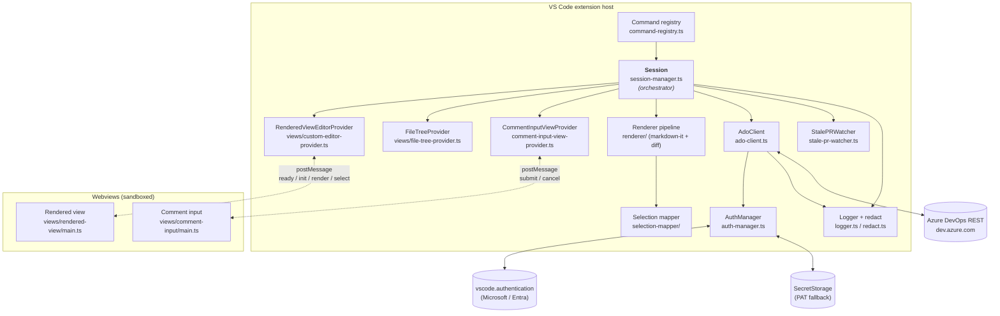

# Development Guide

This guide is the day-to-day developer companion for the
`markdown-pr-review` VS Code extension. It explains how the build is
wired together, how the runtime pieces fit, and the design decisions
and quirks worth knowing about before changing the code.

If you are *running* the extension rather than developing it, start
with the [README](../README.md). If you are submitting a change, also
read [CONTRIBUTING.md](../CONTRIBUTING.md) for the workflow expected
from contributors.

For the formal product specification, see:

- [`docs/requirements.md`](requirements.md) — `REQ-XXX` definitions.
- [`docs/design.md`](design.md) — architecture-of-record and decision
  log.
- [`docs/validation-plan.md`](validation-plan.md) — `TC-XXX` test cases.

## What this extension does

Turns Azure DevOps pull requests for markdown files (design docs,
architecture proposals) into a Word-style review surface: fully
rendered prose + mermaid + diff gutters, with text selections that
round-trip to real ADO PR threads.

## Commands

```powershell
npm install
npm run watch         # esbuild only — re-bundles src/ on save
npm run build         # tsc --noEmit + esbuild (production)
npm run lint          # ESLint flat config; CI enforces zero warnings
npm test              # mocha (tsx loader) against test/unit/**/*.test.ts
npm run test:coverage # mocha under c8; writes coverage/ and enforces thresholds
npm run package       # build + vsce package — produces a .vsix (gitignored)
```

Run one test file ([`.mocharc.cjs`](../.mocharc.cjs) wires the `tsx`
loader, so no extra
flags are needed):

```powershell
npx mocha test/unit/selection-mapper/normalize.test.ts
```

`npm run watch` does **not** run `tsc`. Periodically run
`npm run build` to catch type errors esbuild silently strips.

`npm run test:coverage` uses [`c8`](https://github.com/bcoe/c8)
(V8 native coverage — pairs cleanly with the `tsx` loader because it
collects coverage from the running V8 instance rather than rewriting
sources). Configuration lives in the `c8` block of
[`package.json`](../package.json). It excludes files that `import`
from `'vscode'` (cannot run under mocha + tsx), the browser-only
webview bundles in `src/views/rendered-view/` and
`src/views/comment-input/`, VS Code-bound tree providers, and
`src/types.ts` (interface-only).
Thresholds (93% lines/statements, 95% functions, 80% branches) gate
the unit-testable surface — CI's `coverage` job fails on regression
and uploads `lcov.info` to Codecov.

Press **F5** in VS Code to launch the Extension Development Host with
the `Run Extension` debug config. The dev host inherits your real VS
Code auth sessions, so ADO sign-in flows work end-to-end.

## Build pipeline

[`esbuild.js`](../esbuild.js) produces **three** bundles in `out/`:

| Bundle | Entry | Format | Notes |
| --- | --- | --- | --- |
| Extension host | [`src/extension.ts`](../src/extension.ts) | CJS, `platform: 'node'`, `external: ['vscode']` | The only thing wired in [`package.json`](../package.json) `main` |
| Rendered-view webview | [`src/views/rendered-view/main.ts`](../src/views/rendered-view/main.ts) | Browser IIFE | Bundles markdown-it + mermaid |
| Comment-input webview | [`src/views/comment-input/main.ts`](../src/views/comment-input/main.ts) | Browser IIFE | Lightweight |

The build also copies `@vscode/codicons/dist/codicon.{css,ttf}` into
`out/codicons/` so the rendered-view webview can `<link>` them (its
`localResourceRoots` only sees `out/`).

TypeScript itself emits **nothing** — `tsc --noEmit` is purely a
type-check. All runtime code comes from esbuild.

## Architecture

The diagram below shows how the major components fit together. The
prose under each subsection explains the design choices and the
contracts in play.



The host runs a single active **`Session`** at a time
([`src/session-manager.ts`](../src/session-manager.ts), ~34 KB — the
orchestrator). A Session owns the PR, the changed-files list, the
per-file raw-content cache, the thread cache, the at-most-one
in-flight draft, and the live `WebviewPanel` references for every
opened `mdpr://` editor.

Files are opened through a **synthetic URI scheme** — `mdpr://` —
built by [`src/mdpr-uri.ts`](../src/mdpr-uri.ts). There is no file
on disk. VS Code routes those URIs to `RenderedViewEditorProvider`,
which materializes the rendered HTML and wires up the postMessage
channel.

```
mdpr://{org}/{project}/{repoId}/{prId}/{filePath}
```

`repositoryId` is a GUID and is filled in only after the first ADO
call resolves repo-name → GUID; `buildMdprUri` throws if it's empty.

### postMessage protocol

Fully typed in [`src/types.ts`](../src/types.ts)
(`HostToRenderedView`,
`RenderedViewToHost`, `HostToInputView`, `InputViewToHost`). When you
add a new message variant, add it to the union there first — both
sides import it.

**Critical race**: the host must wait for the webview to post `ready`
before sending `init`. SessionManager tracks this per-panel in
`webviewReady: Map<string, {promise, resolve}>`. Webview message
handlers must be wired **before** `webview.html` is assigned —
otherwise early posts disappear (see commits `12ab427`, `df4a54c`).

### Selection mapper

`src/selection-mapper/` is the conceptual core. It converts a DOM
selection from the rendered webview into ADO-shaped
`{rightFileStart, rightFileEnd}` line/offset pairs against the **raw
markdown source**. It returns one of six modes:

- `precise` — single block, single match after text normalization.
- `coarse-mermaid`, `coarse-html-block` — selection is inside a
  block we can't precisely map back; anchor to the whole block.
- `coarse-multi-block` — selection spans block boundaries.
- `coarse-ambiguous-text` — normalized selection text matches
  multiple positions and disambiguation failed.
- `coarse-text-not-found` — selection text isn't in the block after
  normalization.

ADO uses **1-indexed** lines and offsets, and **`offset: 9999`** is
the end-of-line sentinel — preserve both conventions whenever you
build a `LineOffset`.

### Diff annotator

[`src/renderer/diff-annotator.ts`](../src/renderer/diff-annotator.ts)
diffs head vs base content per
markdown block and emits `DiffAnnotation[]` with states `unchanged`,
`added`, `modified`, `context-of-deletion`. The webview renders these
as gutter bars; the deleted-content text is shown on hover only.

### Auth

[`src/auth-manager.ts`](../src/auth-manager.ts) prefers
`vscode.authentication.getSession('microsoft', ['499b84ac-1321-427f-aa17-267ca6975798/.default'])`
(the ADO resource scope). When the Microsoft provider is unavailable
or rejects, it falls back to a Personal Access Token stored in VS
Code's `SecretStorage` (OS keychain). The ADO client auto-retries
once on `401` with a freshly acquired token before surfacing
`E_ADO_AUTH`.

### Logging and secrets

Use `getLogger('ComponentName')` from
[`src/logger.ts`](../src/logger.ts) — **never**
`console.log`. Anything that may carry tokens, PATs, JWTs, or
ADO-response bodies must be routed through `redact(...)` in
[`src/redact.ts`](../src/redact.ts) before reaching the output
channel. The output
channel is opened with the `log` languageId so VS Code's log-grammar
colorizer applies.

### Content Security Policy

[`src/views/csp.ts`](../src/views/csp.ts) builds a strict per-load
CSP with a unique nonce.
`style-src` and `font-src` include `https:` so user-configured
`markdown.styles` URLs and web fonts load — don't remove that without
a migration plan for the live-restyle feature.

## ADO quirks worth knowing

- File paths carry a **leading slash** (`/docs/design.md`); preserve
  it through the round-trip — `parseMdprUri` reconstructs it.
- Do **not** send `Accept: application/octet-stream` on
  `git/repositories/.../items` — it breaks on large repos (fixed in
  `0.4.5`).
- The fetch timeout (`HttpAdoClient`) covers the response body read,
  not just the connection (fixed in `0.4.4`). Default 90 s.
- Only Azure DevOps **Services** (`dev.azure.com`) is exercised; ADO
  Server is unsupported.

## Where to find what

- [`src/session-manager.ts`](../src/session-manager.ts) — orchestrator;
  per-panel ready-signal map; live-restyle on `markdown.styles` /
  `markdown.preview` config change.
- [`src/ado-client.ts`](../src/ado-client.ts) — REST client;
  PR/threads/items endpoints; 401 retry; error classification.
- [`src/views/rendered-view/main.ts`](../src/views/rendered-view/main.ts) —
  webview entry; receives `init`, paints HTML, hosts selection
  handler + popovers + mermaid loader.
- [`src/types.ts`](../src/types.ts) — single source of truth for
  cross-boundary types.
- [`docs/design.md`](design.md) — architecture (§3) and contracts
  (§4); the decisions log at §5 records the "rendered-view in custom
  editor", "sidebar comment input", and "block + text selection"
  tradeoffs.
- [`docs/requirements.md`](requirements.md) — REQ-XXX definitions and
  explicit out-of-scope list (§2.2).
- [`docs/validation-plan.md`](validation-plan.md) — TC-001…TC-165;
  reference these when adding tests for new behavior.

## Things that have bitten this codebase

1. Forgetting to wait for webview `ready` before posting `init`
   (silent empty render).
2. Registering the webview message handler **after** `webview.html`
   (early posts get dropped).
3. Logging an unredacted response body and discovering a JWT in the
   output channel.
4. Touching `localResourceRoots` without including the user-style
   directories — links 404 silently.
5. Computing `LineOffset` with 0-indexed line numbers — ADO accepts
   the call and silently anchors to the wrong line.

## Releasing

Releases are end-to-end automated. A signed annotated `vX.Y.Z` tag
push triggers
[`.github/workflows/release.yml`](../.github/workflows/release.yml),
which publishes the `.vsix` to the Visual Studio Marketplace (via
federated Microsoft Entra ID — no PAT) and creates a matching
GitHub Release with the `.vsix` attached.

The full procedure (release-bump PR, signed tag, reruns,
pre-releases, and the one-time Azure bootstrap) is documented in
[**CONTRIBUTING.md → Cutting a release**](../CONTRIBUTING.md#cutting-a-release).
The workflow's header comment explains the privilege-separation
trust model (low-priv `package` job + elevated `publish` job with no
checkout).

## Code conventions

See [`docs/coding-style.md`](coding-style.md) for the full
per-language style guide. The high-level rules:

- **2-space indent**, **LF** line endings (enforced by EditorConfig).
- **ESLint flat config**
  ([`eslint.config.mjs`](../eslint.config.mjs)) is the style source
  of truth. CI fails on any warning. `npm run lint -- --fix` for
  auto-fixes.
- Prefer **named exports**; default exports are not used anywhere.
- `import type { ... }` for type-only imports (rule:
  `consistent-type-imports`). `typeof import('...')` is permitted
  for dynamic-import typing (see
  [`src/views/rendered-view/mermaid-loader.ts`](../src/views/rendered-view/mermaid-loader.ts)).
- **`_` prefix** marks intentionally-unused vars/params (e.g.
  `_token: vscode.CancellationToken`).
- `eqeqeq` enforced, but `== null` is allowed for the
  null-or-undefined idiom.
- **Conventional Commits** with one project-local addition: `ui:`
  for visual-only changes that aren't fixes or features.
- Doc citations use stable IDs: `REQ-XXX`
  ([`docs/requirements.md`](requirements.md)), `RISK-XXX`, `TC-XXX`
  ([`docs/validation-plan.md`](validation-plan.md)), `ASM-XXX`. The
  historical `D-XXX` (decisions.md) and `TASK-XXX`
  (implementation-plan.md) IDs were retired in commit `e02d5b3` —
  don't reintroduce them.
